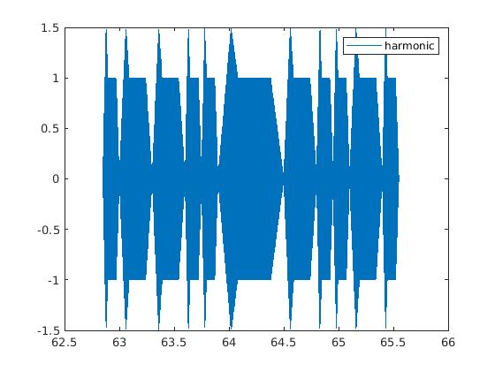
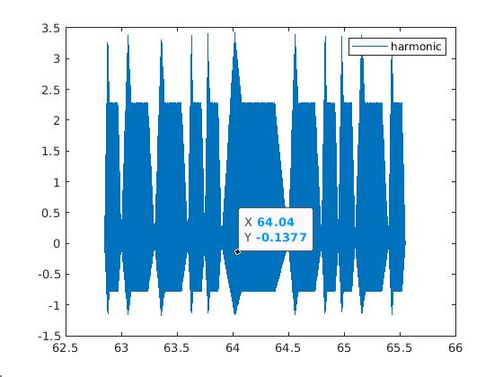
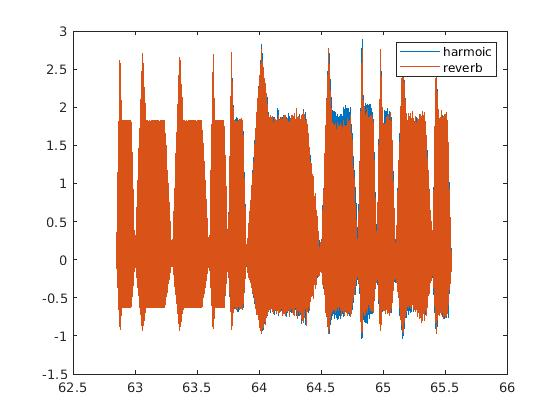
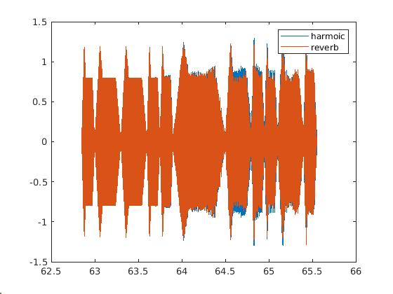
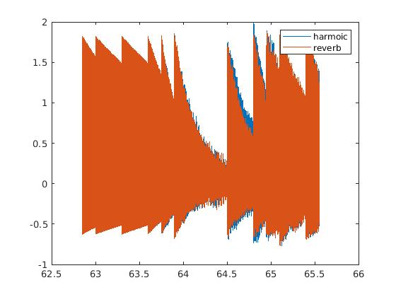

Hossein Mohammadi

030117098

BIM 311 - Sinyal İşleme

Proje: MATLAB ile sentezleme

# Proje Tanıtımı (Hedefler ve Açıklamalar)

<i>Herhangi bir notanın(tercihen tek enstrümanlı) musicxml dosyası oluşturulup Matlab programı yardımıyla parse edilmek. Daha sonra parse işleminden meydana gelecek matrisin bazı sütunları kullanılarak o notaların frekanslarını bulup bir sinyal oluşturduktan sonra (harmonikler, echo ve zarf gibi bazı iyileşmeler yaparak) müziği sentezleyip çaldırmak</i>

Gidişat Yolu

<ul>
  <li><b>musicxml uzantılı dosya oluşturma ve parse etme</b>
      <ul>
          <li>isteği üzrine seçilen müziğin notaları <a href="https://musescore.org/tr">MuseScore programında</a>  oluşturulp daha sonra musicxml file olarak export edilebilir.</li>
          <li>
            Daha sonra <a href="https://gist.github.com/fabiozeh/62018d04ee9f507bf800d157e89c579f">yazılmış parseMusicXML matlab fonksiyonu</a> kullanarak oluşturulmuş musicxml dosyasının adı parametre olarak fonksiyona atanıp bir matris elde edilecek. 
          </li>
      </ul>
  </li>
</ul>

<ul>
  <li><b>Parse İşleminden Meydana Gelen Matrisi Yorumlama</b>
      <ul>
          <li>
    Elde edilecek matrisin sütun sayısı 19 olmak ile beraber satır sayısı müziğin uzunluğuna bağlı olarak değişmektedir.
    Matrisin 1 ve 2. sütunları sırasıyla notanın başlangıcı (başladığı yer) ve ne kadar süre içerisinde çalınacağını beat (vuruş) cinsinden ifade edilmektedir.
          </li>
          <li style="color:   #8dc0f9   ">
             MIDI nedir? MIDI,  Musical Instrument Digital Interface ifadesinin kısaltması olup bilgisayar ile diğer enstrüman aletler arasındaki iletişimi sağlayan bir dildir.
          </li>
            <li>
              4.sütun olan midi pitch, MIDI'deki notaların karşılğıdır. Yani pitches veya notes played dediğimiz dördüncü sütunda bulunan sayısal  değerler kullanılarak melodin içinde hangi notaların bulunduğu öğrenilebilir. 
              Buna göre 

        [midi_number  =  12*log2(fm/440 Hz) + 69]     ve    [fm  =  2(m−69)/12(440 Hz)]
        

        midi pitch ve frekans arasındaki bağıntılardır.

          </li>  
          <li>
              Beşinci sütun olan midi velocity ise bir notanın ilgili tuşuna ne kadar hızlı ve sert basıldığının sayısal değerini ifade etmektedir.
          </li>    
          <li>
            Altı ve yedinci sütunlar bir ve ikinci sütunlar gibi notanın hangi aralıkta çalındığı ile ilgili fakat saniye cinsinden ifade edilmiştir.
          </li>
          <li>
              Aynı zamanda ikinci sütun her bir notanın ölçüsünü ifade etmektedir.
          </li>
      </ul>
  </li>
</ul>

<ul>
  <li><b>note.m Fonksiyonu Yazma</b>
      <ul>
          <li>
            note.m  tek parametreli bir fonksiyon olup matrisin 4.sütununda bulunan her bir notanın midi pitch değerine karşılık gelen tamsayılar girdi olarak alıp ilgili notanın frekansını döndürmektedir.
          </li>
          <li>
              4.sütundaki keyleri frekansa çeviren formül ise 

              [fm  =  2(m−69)/12(440 Hz)]

              şeklinde tanımlanır.
          </li>
      </ul>
  </li>
</ul>

<ul>
  <li><b>sentez.m</b>
      <ul>
          <li>
            sentez.m dosyası programın genel akışını içermektedir.Programın akışı ise aşağıdaki gibidir.
              <ol>
                  <li>
                      musicxml dosyası parse edilir. <kbd>music</kbd> 
                  </li>
                  <li>
                      gerekli sütunları ilgili değişkenelerine atanır.<kbd> keys</kbd><kbd> start</kbd> <kbd>finish</kbd> <kbd>measures</kbd>
                  </li>
                  <li>
                      Örnekleme frekansı belirlenir <kbd>fs</kbd>
                  </li>
                  <li>
                      <kbd>harmonics</kbd>değişkeni her bir notaya kaç harmonik eklenecek diye ifade etmektedir.
                  </li>
                  <li>
                      <kbd>dtotal_signal</kbd> ve <kbd>total_time</kbd> değişkernleri toplam sinyal ve toplam süre her sinyali süresine göre arka arkaya toplamak için tanımlanmıştır.
                  </li>
                  <li>
                      <kbd>X</kbd> değişkeninde ise genliğin değeri tutulur.
                  </li>
                  <li>
                      For Döngüsünün içine gelindiğinde 
                      <kbd>keys</kbd> matrisinde bulunan her bir değere karşılık gelen notaın frekansı note.m fonksiyonu çağırılarak bulunacak, <kbd>duration</kbd> diye tanımlanmış değişkende notanın başlangıcı ve bitişi ç
                      arasında 1/fs adımlarla ilerleyerek bir süre tanımlanacak.
                  </li>
                  <li>
                      <kbd>tone</kbd>sinüsoidal bir sinyalin exponentioal halidir.
                  </li>
                  <li>
                      <kbd>envelope</kbd>fonksiyonu start finish fs  measure ve mode olmak üzere beş parametre alacak şekilde     yazılmıştır.Eğer ADSR zarfı döndürülmek istenirse mode olarak belirttiğimiz parametre yerine fonksiyona 1 parameteresi girilmeli.(mode kodun başında da değiştirilebilir).Aynı zamanda mode olarakfonksiyona 2 parametresi girildiği sürece fonkisyon, istenen exponentioal zarfı olduğunu anlayıp onu döndürecek.
                  </li>
                  <li>
                      Diğer ikinci for döngüsü ise <kbd>harmonics </kbd>değişkenine atanan değer kadar iligi notaya hatmonikler ekleyecek. 
                      
Eklenecek her bir harmoniğin genliği 1 / <kbd>kk</kbd> (kaçıncı harmonik) ve frekansı fundamental frekans * <kbd>kk</kbd> (kaçıncı harmonik) olacak.

                  </li>
                  <li>
                      Daha sonra sinyal seçilen zarf ile çarpılır.
                  </li>
                  <li>
                      Sonra her bir nota bir önceki notanın arkasına gelecek şekilde <kbd> total_signal</kbd> matrisine eklenecek.
                  </li>
                  <li>
                      MATLAB'te bulunan <kbd>reverberation </kbd> fonksiyonu kullanılarak müziğe echo eklenir. Bu işlemin yapılışı ise ilk olarak <kbd>reverberation</kbd> fonksiyonun parametreleri girilir. Burada kullanılan iki özellik kullanıldı.<kbd>PreDelay</kbd> & <kbd>WetDryMix</kbd>
                      . Ayarlamalar yapıldıktan sonra fonkisyonun döndürdüğü reverb objesi sayesinde echo eklenecek.Burada Dikkat edilmesi gerek yer ise reverb objesinin sadece (specified as a column vector or two-column matrix)
                      sütun vectörü yada   matris(n*1 yada n*2) olacak şekilde argüment alacak. Burada <kbd>total_signal</kbd> matrisinin transpozu alınmalıdır. 
                  </li>
                  
              </ol>
          </li>
      </ul>
  </li>
</ul>

<h1>Uygulamada Seçilen Müziğin Notaları</h1>
</img>

ADSR Zarfı ile Oluşturulan Sinyalin Grafiği

</img>

Harmonik eklenip ADSR Zarfı ile Oluşturulan Sinyalin Grafiği

</img>

Harmonik eklenip Exponential ile Oluşturulan Sinyalin Grafiği

</img>

Harmonik eklenip ADSR ile Oluşturulan Sinyale Reverb Eklenmiş halinin Grafiği

</img>

ADSR ile Oluşturulan Sinyale Reverb Eklenmiş halinin Grafiği

</img>

Harmonik eklenip Exponential ile Oluşturulan Sinyale Reverb Eklenmiş halinin Grafiği

</img>

 Yukarıdaki grafikler yalnızca 16. ölçüdeki notaların grafiğidir.

